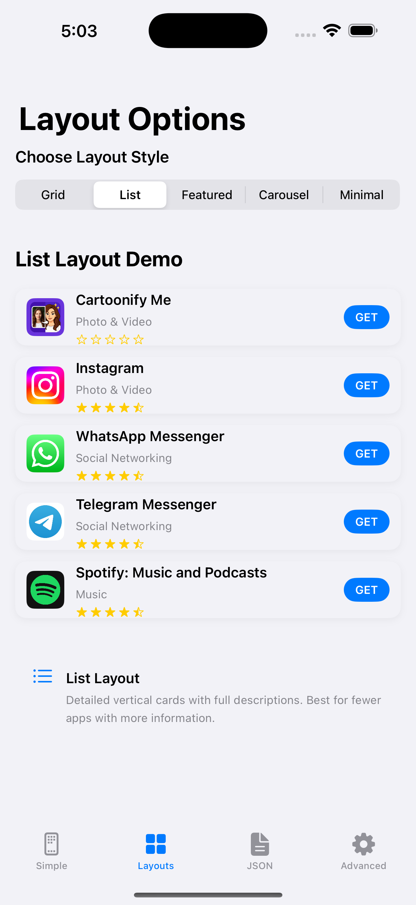
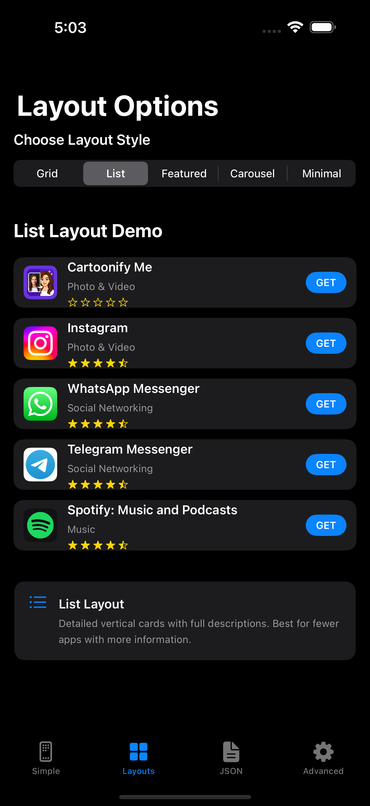
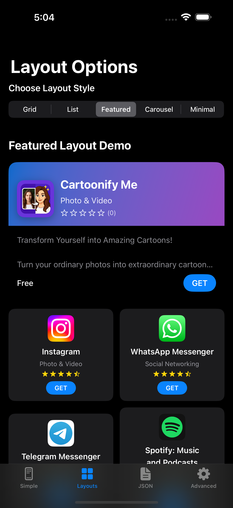
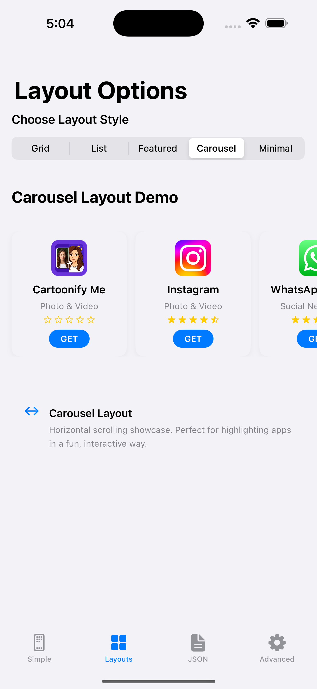

# OtherApps SwiftUI Library

[](https://swift.org)
[](https://developer.apple.com)
[](https://github.com/apple/swift-package-manager)
[](LICENSE)

A beautiful, professional SwiftUI library for showcasing your other apps from the App Store. Automatically fetches app metadata including icons, descriptions, ratings, and more from iTunes Search API.

## ✨ Features

- **Automatic App Data Fetching**: Just provide App Store URLs, we handle the rest
- **Multiple Layout Options**: Grid, List, Carousel, and Featured layouts
- **Beautiful Design**: Modern, native iOS design with smooth animations
- **JSON Configuration**: Load apps from your website's JSON file
- **Smart Caching**: Efficient image and data caching
- **Error Handling**: Graceful error states and loading indicators
- **Easy Integration**: Drop-in SwiftUI component

## 📱 Screenshots

### Demo App Overview


### Grid Layout - App Store Style


### List Layout - Detailed Cards


### Carousel Layout - Horizontal Scroll


### Featured Layout - Highlight First App


### Compact Cards - Perfect for Grid


### Standard Cards - Rich Information


### Loading States - Smooth UX


### Error Handling - Graceful Fallbacks


### JSON Configuration - Dynamic Content


### Layout Comparison
- **Grid Layout**: Perfect for showcasing multiple apps in App Store style
- **Featured Layout**: Highlight one app with others below in compact grid
- **List Layout**: Detailed view with full descriptions and ratings
- **Carousel**: Horizontal scrolling showcase for featured apps

## 🚀 Quick Start

### 1. Basic Usage

```swift
import SwiftUI
import OtherApps

struct ContentView: View {
    var body: some View {
        OtherAppsView.withUrls([
            "https://apps.apple.com/us/app/cartoonify-me/id6747951776",
            "https://apps.apple.com/us/app/instagram/id389801252"
        ])
    }
}
```

### 2. From JSON URL

```swift
OtherAppsView.withJsonUrl("https://yourwebsite.com/apps.json")
```

### 3. Custom Configuration

```swift
let config = AppsConfiguration(
    apps: [
        AppConfig(appStoreUrl: "https://apps.apple.com/us/app/cartoonify-me/id6747951776", featured: true),
        AppConfig(appStoreUrl: "https://apps.apple.com/us/app/instagram/id389801252")
    ],
    title: "My Amazing Apps",
    subtitle: "Check out what I've built!"
)

OtherAppsView(configuration: config, layout: .featured)
```

### 4. Different Layouts

```swift
// Grid layout (default)
OtherApps.view(urls: yourUrls, layout: .grid)

// Featured layout (first app highlighted)
OtherApps.view(urls: yourUrls, layout: .featured)

// List layout (detailed cards)
OtherApps.view(urls: yourUrls, layout: .list)

// Carousel (horizontal scrolling)
OtherApps.view(urls: yourUrls, layout: .carousel)
```

## 📝 JSON Configuration Format

Create a JSON file on your website with this structure:

```json
{
  "title": "My Other Apps",
  "subtitle": "Check out my other creations!",
  "apps": [
    {
      "url": "https://apps.apple.com/us/app/cartoonify-me/id6747951776",
      "featured": true,
      "title": "Custom Title (Optional)",
      "description": "Custom Description (Optional)"
    },
    {
      "url": "https://apps.apple.com/us/app/another-app/id123456789",
      "featured": false
    }
  ]
}
```

## 🎨 Customization

### Layout Options

```swift
public enum OtherAppsLayout {
    case list       // Vertical list with full-width cards
    case grid       // 2-column grid with compact cards
    case carousel   // Horizontal scrolling carousel
    case featured   // Featured first app + grid of others
}
```

### Handle App Taps

```swift
OtherAppsView(
    configuration: config,
    onAppTap: { app in
        // Custom action when user taps an app
        print("User tapped: \(app.name)")
        // Default behavior: opens App Store
    }
)
```

### As View Modifier

```swift
struct MyAppView: View {
    var body: some View {
        ScrollView {
            // Your app content
            Text("Welcome to my app!")
            
            // Add other apps at the bottom
        }
        .otherApps(urls: [
            "https://apps.apple.com/us/app/cartoonify-me/id6747951776"
        ])
    }
}
```

## 🔧 Installation

### Swift Package Manager

1. In Xcode, go to **File → Add Package Dependencies**
2. Enter this repository URL:
   ```
   https://github.com/asilarslan/OtherApps
   ```
3. Click **Add Package**

Or add it to your `Package.swift`:

```swift
dependencies: [
    .package(url: "https://github.com/asilarslan/OtherApps", from: "1.0.5")
]
```

### Manual Installation

1. Download the `OtherApps` folder
2. Add it to your Xcode project
3. Import `OtherApps` in your SwiftUI files

## 📋 Requirements

- iOS 15.0+ / macOS 12.0+ / watchOS 8.0+ / tvOS 15.0+
- SwiftUI
- Xcode 13+
- Swift 5.7+

## 🌐 App Store URL Formats Supported

The library automatically extracts App IDs from various App Store URL formats:

- `https://apps.apple.com/us/app/app-name/id123456789`
- `https://apps.apple.com/app/id123456789`
- `https://itunes.apple.com/app/id123456789`

## ⚡ Performance

- **Smart Caching**: Images and app data are cached for fast loading
- **Lazy Loading**: Apps load progressively to avoid blocking the UI
- **Memory Efficient**: Optimized for smooth scrolling with many apps
- **Network Efficient**: Minimal API calls with intelligent retry logic

## 🛠️ Advanced Usage

### Custom Service Configuration

```swift
// Access the shared service for custom configuration
let service = AppStoreService.shared

// Fetch apps manually
Task {
    let apps = try await service.fetchApps(from: jsonUrl)
    // Handle apps...
}
```

### Error Handling

The library provides comprehensive error handling:

```swift
enum AppStoreServiceError: LocalizedError {
    case invalidURL
    case invalidAppStoreURL
    case invalidResponse
    case appNotFound
    case networkError(Error)
    case decodingError(Error)
}
```

## 🎯 Use Cases

Perfect for:
- **Settings screens** - Show your other apps to users
- **About pages** - Showcase your app portfolio  
- **Onboarding flows** - Cross-promote your apps
- **Marketing pages** - Beautiful app galleries
- **Developer portfolios** - Display your work

## 📄 License

This project is licensed under the MIT License - see the [LICENSE](LICENSE) file for details.

## 🤝 Contributing

Contributions are welcome! Please feel free to submit a Pull Request.

1. Fork the project
2. Create your feature branch (`git checkout -b feature/amazing-feature`)
3. Commit your changes (`git commit -m 'Add some amazing feature'`)
4. Push to the branch (`git push origin feature/amazing-feature`)
5. Open a Pull Request

## 📧 Support

If you have questions or need help:

- 🐛 **Bug reports**: [Open an issue](../../issues)
- 💡 **Feature requests**: [Open an issue](../../issues)  
- 💬 **Questions**: [Start a discussion](../../discussions)

## ⭐ Show Your Support

If this library helped you, please consider:
- ⭐ Starring the repository
- 🐦 Sharing it on Twitter
- 📝 Writing a blog post about it

---

**Made with ❤️ for iOS developers who want to showcase their apps beautifully.** 